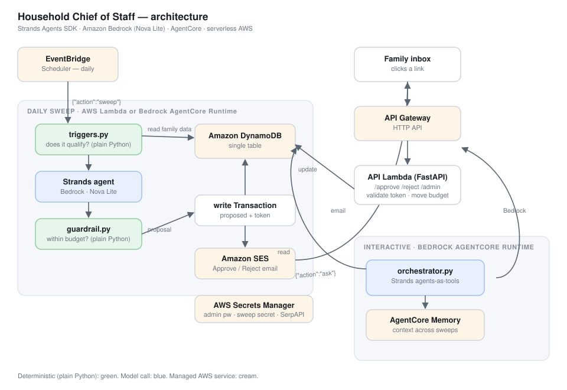

# Household Chief of Staff

A background AI agent that runs a daily **sweep** over a family's data — kids'
clothing sizes, upcoming birthdays/anniversaries, grocery reorder cadence,
travel-wishlist prices — decides what needs to happen in each of four
categories, checks every proposal against a per-category monthly budget **in
plain code**, and emails one recommendation with a data-grounded justification
and Approve / Reject links.

It is not another app you open. It runs on a schedule, stays quiet, and
surfaces only when there is a real decision to make. Approving logs a simulated
transaction and moves a budget counter — **nothing here moves real money or
places a real order.**

Built with the **[Strands Agents SDK](https://strandsagents.com)** on **Amazon
Bedrock** for the *Agents for Humans* hackathon (Everyday Agents track).

> **Companion path:** ask the chief of staff a question — *"why did you propose
> the hamper?"*, *"what's coming up in groceries?"* — and a Strands
> *agents-as-tools* orchestrator answers from live data, on **Bedrock AgentCore
> Runtime**, with **AgentCore Memory** carrying context across sweeps.

---

## Who it's for

Anyone running a household who loses time to a rolling list of small,
judgement-light-but-not-zero decisions: *have the kids outgrown their shoes? is
a gift sorted for the anniversary? did the grocery reorder go out? is now a
cheap time to book those flights?* None is hard; together they are a permanent
background tax on attention. This agent carries that list.

---

## How it works



```
EventBridge Scheduler (daily)
  └─> Sweep  (AWS Lambda, or Bedrock AgentCore Runtime)
        ├─ triggers.py        does any category even have a candidate?      [plain Python]
        ├─ Strands agent      what should we propose, and why?             [Amazon Nova Lite]
        ├─ guardrail.py       is it within the category budget?            [plain Python]
        ├─ DynamoDB           write the proposal as a Transaction
        └─ Amazon SES         email the family: Approve / Reject
  └─> a link is clicked
        └─> API Gateway + Lambda (FastAPI)  validate per-transaction token,
             update DynamoDB, move the budget counter, run the side effect
```

### The design decision that matters: keep the model boxed in

The model never decides **whether** to act, and never decides **whether
something is affordable**. Both are plain Python:

- **Before** the model — `triggers.py` decides whether a category has a
  candidate worth reasoning about (sizing 90+ days stale or a season boundary
  crossed; an event within 14 days; a grocery item past its cadence; a watched
  trip at/near target price). The agent only ever sees already-qualified
  candidates.
- **After** the model — `guardrail.py` checks the proposed amount against the
  remaining budget. Over-budget proposals are **not** silently dropped — they
  are flagged `needs_override` and still emailed, clearly marked.

The Strands agent's job is narrow: given a qualified candidate and the real
data, produce a proposal and a justification grounded in the actual numbers.

### Two Strands surfaces

| Surface | Pattern | Where |
|---|---|---|
| Per-category proposal | one `Agent` + `structured_output(ProposalBatch, …)` | `agents/{wardrobe,gifts,groceries,travel}.py` |
| "Ask the chief of staff" | **agents-as-tools** orchestrator + read-only data tools | `agents/orchestrator.py`, served by `runtime.py` on AgentCore |

---

## AWS services used

| Service | Role |
|---|---|
| **Amazon Bedrock** (Nova Lite, `us.amazon.nova-lite-v1:0`) | reasoning + justification for each category |
| **Bedrock AgentCore Runtime** | hosts the agent for async background execution + interactive Q&A |
| **Bedrock AgentCore Memory** | cross-sweep context for the "ask" path |
| **AWS Lambda** | scheduled sweep; FastAPI approve/reject/admin surface (via Mangum) |
| **Amazon API Gateway** (HTTP API) | public endpoint for the email links + dashboard |
| **Amazon DynamoDB** | single-table store: family, budgets, transactions, price history, sweep log |
| **Amazon EventBridge Scheduler** | fires the daily sweep |
| **Amazon SES** | sends the approval-request email (the one real external action) |
| **AWS Secrets Manager** | admin password, sweep secret, SerpAPI key |
| **AWS SAM / CloudFormation** | infrastructure as code (`infra/template.yaml`) |

External: **SerpAPI** for live current flight prices. Historical price trend is
synthetic seed data standing in for a production time-series pipeline — see
`scripts/seed_data.py`.

---

## Repository layout

```
src/household_agent/
  config.py            env-driven configuration
  models.py            domain dataclasses
  triggers.py          deterministic "does this qualify?" rules
  guardrail.py         deterministic budget enforcement
  side_effects.py      post-approval record updates
  sweep.py             the daily pipeline (trigger → agent → guardrail → DynamoDB → SES)
  notify.py            Amazon SES send
  memory.py            AgentCore Memory session manager
  runtime.py           AgentCore Runtime entrypoint  {"action": "sweep" | "ask"}
  scheduled.py         plain Lambda handler for the daily sweep (AgentCore-free path)
  data/
    table.py           the single DynamoDB access point
    price_service.py   SerpAPI wrapper
  agents/
    model.py           BedrockModel factory (Nova Lite)
    schemas.py         Pydantic ProposalBatch (structured output)
    base.py            build_agent() + propose_batch()
    wardrobe.py gifts.py groceries.py travel.py
    orchestrator.py    agents-as-tools orchestrator + read-only data tools
  api/
    dashboard.py       admin dashboard: state aggregation + HTML
    app.py             FastAPI routes
    handler.py         Mangum adapter for Lambda
infra/
  template.yaml        AWS SAM stack
  agentcore/           AgentCore Runtime container + deploy notes
scripts/
  seed_data.py create_memory.py demo_reset.py local_sweep.py
tests/                 hermetic — no AWS needed
docs/                  ARCHITECTURE.md, TESTING.md, BUILD_PLAN.md, BUILD_JOURNAL.md, architecture.svg
```

---

## Setup

### Prerequisites

- Python 3.11+ and the AWS CLI, authenticated (`aws configure`).
- **Amazon Bedrock model access** enabled for `amazon.nova-lite-v1:0` (and the
  `us.` cross-region inference profile) in your region — request it in the
  Bedrock console → *Model access*.
- [AWS SAM CLI](https://docs.aws.amazon.com/serverless-application-model/latest/developerguide/install-sam-cli.html).
- A **verified SES identity** for the sender address, and — while your account
  is in the SES sandbox — a verified recipient address too.
- (Optional) a [SerpAPI](https://serpapi.com) key for live flight prices.

### Local development

```bash
python3 -m venv .venv && source .venv/bin/activate
pip install -r requirements.txt

cp .env.example .env          # fill in region, model id, SES addresses, secrets
export $(grep -v '^#' .env | xargs)

python scripts/seed_data.py   # writes the demo family into DynamoDB (needs the table — deploy first, or point at a local DynamoDB)
python scripts/local_sweep.py --dry   # run one sweep, skip the email
uvicorn household_agent.api.app:app --reload   # http://localhost:8080/admin
```

### Deploy to AWS

```bash
sam build --template infra/template.yaml

# First deploy — BaseUrl unknown yet
sam deploy --guided \
  --template infra/template.yaml \
  --stack-name household-agent \
  --capabilities CAPABILITY_IAM \
  --parameter-overrides \
    SesSenderAddress=you@example.com \
    ApprovalRecipient=you@example.com \
    AdminPasswordValue=<pick-one> \
    SweepSecretValue=<pick-one> \
    SerpApiKeyValue=<serpapi-key-or-none>

# Copy the ApiBaseUrl output, then redeploy so email links resolve
sam deploy --parameter-overrides ... BaseUrl=https://<api-id>.execute-api.<region>.amazonaws.com/prod
```

Outputs give you `ApiBaseUrl` and `AdminUrl`. Then seed and trigger a sweep:

```bash
python scripts/seed_data.py                       # against the deployed table
aws lambda invoke --function-name household-agent-sweep /dev/stdout
```

Open `AdminUrl` (HTTP Basic Auth: `admin` / your `AdminPasswordValue`).

### Deploy the AgentCore Runtime (interactive "ask" path + optional sweep host)

See **[`infra/agentcore/README.md`](infra/agentcore/README.md)** —
`create_memory.py`, then `agentcore configure` / `agentcore deploy` / `agentcore
invoke`.

---

## Testing

```bash
pip install -r requirements.txt
pytest -q
```

**19 tests, fully hermetic** — an in-memory fake replaces the DynamoDB layer, so
the suite needs no AWS credentials, no boto3, and no Bedrock access:

- `test_guardrail.py` — within-limit vs `needs_override`, exact-boundary, and
  that spend-so-far is counted.
- `test_triggers.py` — wardrobe staleness + season crossing, gift lookahead and
  same-year dedupe, grocery cadence, travel target band and status.
- `test_sweep.py` — the pipeline: guardrail result recorded on the transaction,
  over-budget proposal still persisted, sweep logged. Category agents (the
  model calls) are stubbed so it stays deterministic.

A reviewer walkthrough — live demo + local — is in
**[`docs/TESTING.md`](docs/TESTING.md)**.

---

## Teardown

```bash
sam delete --stack-name household-agent
# and, if deployed:
agentcore destroy --name household-chief-of-staff
```

---

## License

**Apache-2.0** — see [`LICENSE`](LICENSE).
